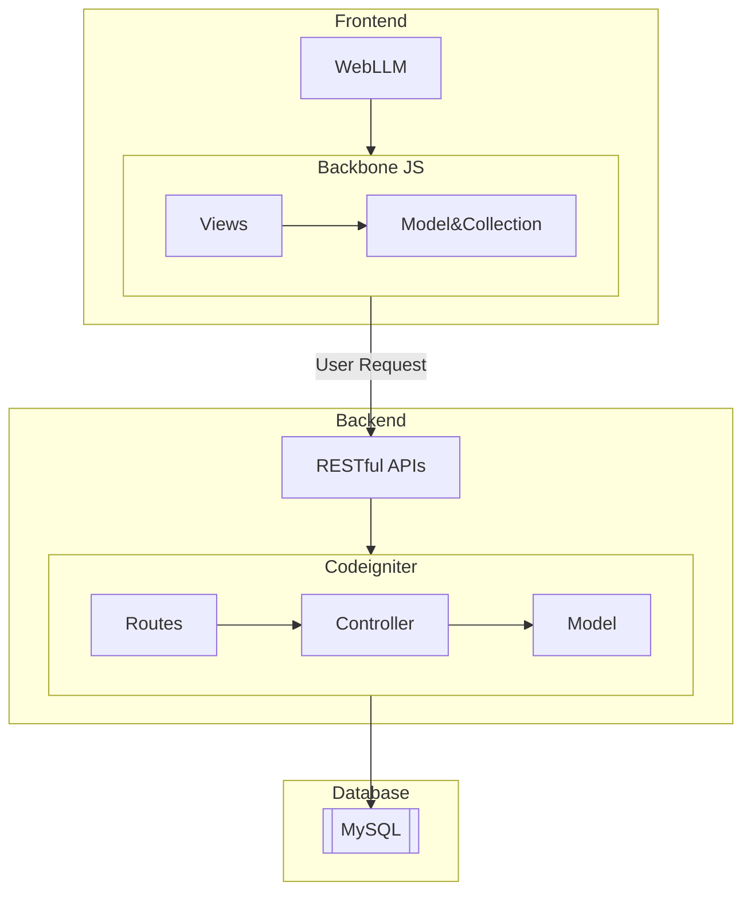
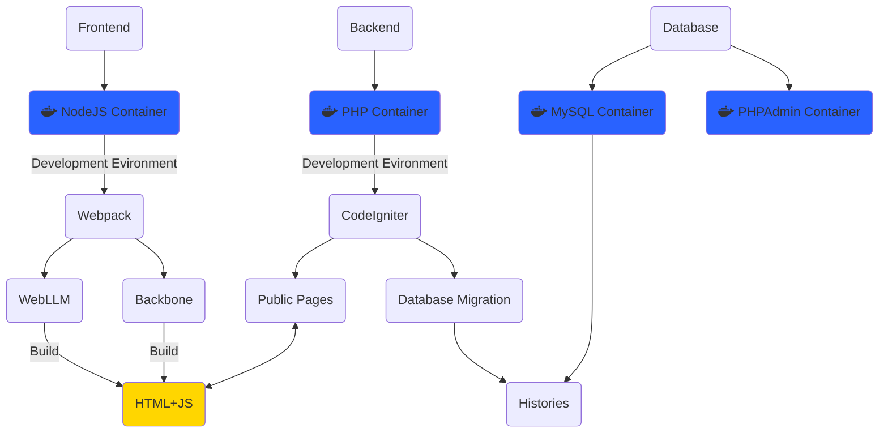

# About this Demo

This demo is for practicing CodeIgniter and Backbone personally, and for trying to implement a Web AI using WebLLM/ONNX. The demo aims to provide a function-calling commander based on a function schema uploaded by the user. The basic architecture of this system consists of a RESTful backend and a Backbone-powered frontend, as shown in the diagram below.

Both CodeIgniter and Backbone follow the MVC pattern. However, in my demo, a full implementation of MVC isn't necessary. For example, I built the site as a single-page application, so the View layer on the backend doesn't have any real functionality. Additionally, since Backbone lacks a default controller layer, I plan to customize and extend it later. The controller layer allows the logic to be divided into smaller, more maintainable modules.

The current stage of my demo involves storing chat histories in the database. It doesn't yet include the user system and sessions. Additionally, function calling is a significant challenge, involving the AI Agent framework, embeddings, and Retrieval-Augmented Generation (RAG). I tried using ONNX, an AI model format and runtime created by Microsoft. However, it ran pretty slowly when executing RAG in a web browser. I switched to WebLLM because it supports a very fast RAG model called Snowflake.

# Development Environment

